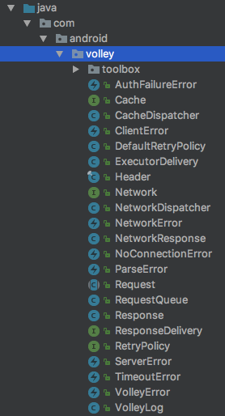
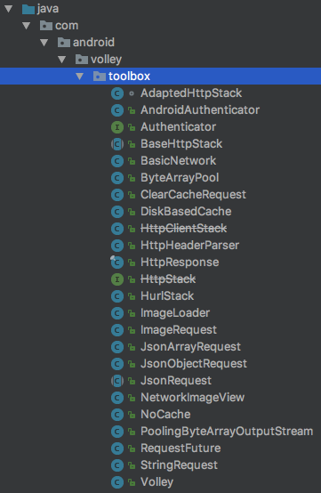
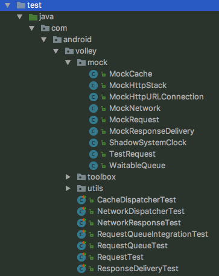

# volley-note
Android Volley 基本用法和源码分析

# Volley
Volley 是一个 Android 平台上的 HTTP 请求库，使得网络请求更加容易，速度更快。  
源代码开源地址：[https://github.com/google/volley](https://github.com/google/volley)

Volley 提供了一下特性：
* 网络请求自动调度
* 支持高并发网络连接
* 透明的磁盘和内存响应缓存与 HTTP 缓存标准保持一致
* 请求支持优先级
* 支持取消单一请求或一定范围的请求
* 定制化容易，比如重试或 backoff
* 强大的排序使得从网络异步获取的数据能正确填充您的用户界面，且这个过程十分容易
* 调试和跟踪工具


Volley 擅长用于填充 UI 的 RPC 类型操作，例如将搜索结果的页面作为结构化数据提取。它可以轻松地与任何协议集成，并支持原始字符串、图像和JSON。通过为您需要的功能提供内置支持，Volley将您从编写样板代码中解放出来，并让您专注于特定于您的应用程序的逻辑。  

Volley 并不适于大文件下载或流操作，因为 Volley 是在内存中解析所有的响应结果的。对于大文件下载操作，建议使用 [DownloadManager](https://developer.android.com/reference/android/app/DownloadManager.html) 或其他替代性方案。

Volley 的核心库是在 GitHub 上开发的，该仓库包含主要的请求调度管道，以及工具箱“toolbox”中提供的一组常用工具。使用 Volley 最容易的方式，是在你的 **build.gradle** 文件中添加下面的依赖：
```gradle
dependencies {
    ...
    // Android Studio 版本小于 3.0
    compile 'com.android.volley:volley:1.1.0'

    // Android Studio 版本大于 3.0
    implementation 'com.android.volley:volley:1.1.0'
}
```

或者你可以克隆整个 Volley 仓库并将值设置为一个 library 项目：
1. 克隆该仓库的命令行：
```
git clone https://github.com/google/volley  
```
2. 将下载后的资源文件作为一个 Android library module 导入到你的项目中，具体步骤可参考 [创建 Android 库](https://developer.android.com/studio/projects/android-library.html) 。

# 基本用法
官方文档总结
* [发起一个简单请求](https://github.com/zhuanghongji/volley-note/blob/master/guide/sending-a-simple-request.md)
* [设置请求队列](https://github.com/zhuanghongji/volley-note/blob/master/guide/setting-up-a-requestqueue.md)
* [发起一个标准请求](https://github.com/zhuanghongji/volley-note/blob/master/guide/making-a-standard-request.md)
* [自定义请求](https://github.com/zhuanghongji/volley-note/blob/master/guide/implementing-a-custom-request.md)

示例
* [示例代码 /sample](https://github.com/zhuanghongji/volley-note/tree/master/sample)
* [示例分析 /sample/README.md](https://github.com/zhuanghongji/volley-note/blob/master/sample/README.md)

# 源码分析
Volley 的源码主要分为三个部分：
* main.java.com.android.volley
* main.java.com.android.volley.toolbox
* test.java.com.android.volley

|共24个类|共22个类|共39个类
|--|--|--
|||

* [Volley 的执行流程](https://github.com/zhuanghongji/volley-note/blob/master/decode/volley-life.md)
* Request RequestFuture // TODO
* StringRequest JsonRequest ImageRequest ClearCacheRequest
* ImageLoader NetworkImageView
* Cache NoCache DiskBasedCache CacheDispatcher
* Network BasicNetwork NetworkDispatcher
* Authenticator AndroidAuthenticator
* HttpStack HttpClientStack BaseHttpStack HurlStack AdaptedHttpStack
* HttpHeaderParser
* VolleyError TimeoutError ParseError AuthFailureError NetworkError ServerError ClientError
* VolleyLog

# 问答
部分内容来自 [https://stackoverflow.com/search?q=Volley](https://stackoverflow.com/search?q=Volley)

* 如何实现同步请求？ // TODO


# 参考文章
* [Transmitting Network Data Using Volley](https://developer.android.com/training/volley/index.html)
* [郭霖：Android Volley 完全解析（一）初识Volley的基本用法](http://blog.csdn.net/guolin_blog/article/details/17482095)
* [郭霖：Android Volley 完全解析（二）使用Volley加载网络图片](http://blog.csdn.net/guolin_blog/article/details/17482165)
* [郭霖：Android Volley 完全解析（三）定制自己的Request](http://blog.csdn.net/guolin_blog/article/details/17612763)
* [郭霖：Android Volley 完全解析（四）带你从源码的角度理解Volley](http://blog.csdn.net/guolin_blog/article/details/17656437)
