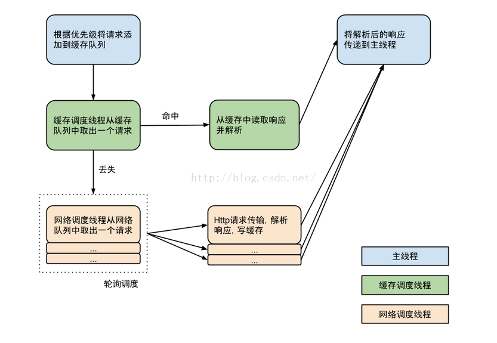
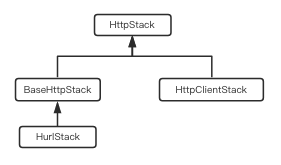

# Volley 的执行流程
下图描述了 `Request` 从加入 `RequestQueue` 到获取响应并解析的执行流程（由官方配图翻译而成，源于网络），本文内容也是围绕着这张图进行描述。  


**要想发送一个请求，首先你要有一个请求队列。**

# Volley.java
创建请求队列最便捷的方法是 `Volley.newRequestQueue(context)`，该方法源码如下：
```java
public static RequestQueue newRequestQueue(Context context) {
    return newRequestQueue(context, (BaseHttpStack) null);
}
```

`newRequestQueue()` 还有另外3个重载方法，其中两个源码如下：
```java
// Use {@link #newRequestQueue(Context, BaseHttpStack)} instead to avoid
// depending on Apache HTTP. This method may be removed in a future
// release of Volley.
@Deprecated
@SuppressWarnings("deprecation")
public static RequestQueue newRequestQueue(Context context, HttpStack stack) {
    if (stack == null) {
        return newRequestQueue(context, (BaseHttpStack) null);
    }
    return newRequestQueue(context, new BasicNetwork(stack));
}
```
```java
public static RequestQueue newRequestQueue(Context context, BaseHttpStack stack) {
    BasicNetwork network;
    // 如果 `stack` 为 `null` 的话，会先创建一个 `HttpStack` ，
    // 这里会根据手机系统版本判断来进行创建，如果手机系统版本号是大于 9 (Android 2.3) ，
    // 则创建一个 `HurlStack`，否则就创建一个 `HttpClientStack`。
    if (stack == null) {
        if (Build.VERSION.SDK_INT >= 9) {
            network = new BasicNetwork(new HurlStack());
        } else {
            // Prior to Gingerbread, HttpUrlConnection was unreliable.
            String userAgent = "volley/0";
            try {
                String packageName = context.getPackageName();
                PackageInfo info = context.getPackageManager().getPackageInfo(packageName, 0);
                userAgent = packageName + "/" + info.versionCode;
            } catch (NameNotFoundException e) {
            }

            network = new BasicNetwork(
                    new HttpClientStack(AndroidHttpClient.newInstance(userAgent)));
        }
    } else {
        network = new BasicNetwork(stack);
    }

    return newRequestQueue(context, network);
}
```
上面几个关键类的关系如下：  
  
* `HurlStack` 继承了抽象类 `BaseHttpStack`
* 抽象类 `BaseHttpStack` 和 `HttpClientStack` 都实现了 `HttpStack` 接口

实际上，`HurlStack` 的内部是使用 `HttpUrlConnection` 进行网络通讯的，而 `HttpClientStack` 的内部是使用 `HttpClient` 进行网络通讯的。

> **HttpURLConnection 和 HttpClient 的选择**  
> **相同点：** Android 中提供了上面两种方式进行 HTTP 操作，都支持 HTTPS 协议、以流的形式进行上传加载、配置超时时间、IPv6、连接池等功能。  
> **不同点：** 在 Android 2.3 版本及之后，HttpURLConnection 的 API 更加简单，体积更小，而且提供的压缩和缓存机制可以有效地减少网络访问的流量，在提升速度和省电方面也起到了较大作用；而在 Android 2.2 版本及之前，只能使用 HttpClient，但其 API 数量过多，使得我们很难在不破坏兼容性的情况下对它进行升级和扩展。

创建了 `HttpStack` 之后，再创建一个 `Network` (`BasicNetwork` 是其实现类) 对象，用于根据传入的 `HttpStack` 对象来处理网络请求。

上述三个重载方法中，最后都是调用了下面这第四个重载方法：
```java
private static RequestQueue newRequestQueue(Context context, Network network) {
  File cacheDir = new File(context.getCacheDir(), DEFAULT_CACHE_DIR);
  RequestQueue queue = new RequestQueue(new DiskBasedCache(cacheDir), network);
  queue.start();
  return queue;
}
```
设置硬盘缓存目录，创建 `RequestQueue` 对象并通过 `start()` 方法进行启动，最后返回的就是一个以启用的请求队列了。

> `context.getCacheDir`: Returns the absolute path to the application specific cache directory on the filesystem. These files will be ones that get deleted first when the device runs low on storage. There is no guarantee when these files will be deleted.

# RequestQueue.java
`RequestQueue` 共有三个构造方法：
```java
/** Number of network request dispatcher threads to start. */
private static final int DEFAULT_NETWORK_THREAD_POOL_SIZE = 4;

...

public RequestQueue(Cache cache, Network network) {
    this(cache, network, DEFAULT_NETWORK_THREAD_POOL_SIZE);
}

public RequestQueue(Cache cache, Network network, int threadPoolSize) {
    this(cache, network, threadPoolSize,
            new ExecutorDelivery(new Handler(Looper.getMainLooper())));
}

/**
 * Creates the worker pool. Processing will not begin until {@link #start()} is called.
 *
 * @param cache A Cache to use for persisting responses to disk
 * @param network A Network interface for performing HTTP requests
 * @param threadPoolSize Number of network dispatcher threads to create
 * @param delivery A ResponseDelivery interface for posting responses and errors
 */
public RequestQueue(Cache cache, Network network, int threadPoolSize,
        ResponseDelivery delivery) {
    mCache = cache;
    mNetwork = network;
    mDispatchers = new NetworkDispatcher[threadPoolSize];
    mDelivery = delivery;
}
```

前面提到的 `start()` 方法到底执行了什么逻辑？
```java
// Starts the dispatchers in this queue.
public void start() {
    stop();  // Make sure any currently running dispatchers are stopped.
    // Create the cache dispatcher and start it.
    mCacheDispatcher = new CacheDispatcher(mCacheQueue, mNetworkQueue, mCache, mDelivery);
    mCacheDispatcher.start();

    // Create network dispatchers (and corresponding threads) up to the pool size.
    for (int i = 0; i < mDispatchers.length; i++) {
        NetworkDispatcher networkDispatcher = new NetworkDispatcher(mNetworkQueue, mNetwork,
                mCache, mDelivery);
        mDispatchers[i] = networkDispatcher;
        networkDispatcher.start();
    }
}
```
可以看出，上面代码先是创建了一个 `CacheDispatcher` 的实例并调用了其 `start()` 方法。接着是在一个 for 循环（4次）里创建 `NetworkDispatcher` 的实例，也分别调用它们的 `start()` 方法。  
* `CacheDispatcher` 继承自 `Thread`，是缓存处理线程
* `NetworkDispatcher` 继承自 `Thread`，是网络请求处理线程

也就是说，当调用了 `Vollet.newRequestQueue(context)` 方法之后，就会有 5 个线程一直在后台运行，不断等待网络请求的到来。  

既然可以启动，那么就可以停止：
```java
// Stops the cache and network dispatchers.
public void stop() {
    if (mCacheDispatcher != null) {
        mCacheDispatcher.quit();
    }
    for (final NetworkDispatcher mDispatcher : mDispatchers) {
        if (mDispatcher != null) {
            mDispatcher.quit();
        }
    }
}

// quit(): Forces this dispatcher to quit immediately.
// If any requests are still in the queue, they are not guaranteed to be processed.
``

创建了请求队列之后，就只需要构造出相应的 `Request` 对象，然后通过 `RequestQueue.add()`方法将该请求对象加入到请求队列中就可以完成网络请求操作了。  
`RequestQueue.add()` 方法源码如下：
```java
/** The cache triage queue. */
private final PriorityBlockingQueue<Request<?>> mCacheQueue;

/** The queue of requests that are actually going out to the network. */
private final PriorityBlockingQueue<Request<?>> mNetworkQueue;

...

public <T> Request<T> add(Request<T> request) {
  // Tag the request as belonging to this queue and add it to the set of current requests.
  request.setRequestQueue(this);
  synchronized (mCurrentRequests) {
      mCurrentRequests.add(request);
  }

  // Process requests in the order they are added.
  request.setSequence(getSequenceNumber());
  request.addMarker("add-to-queue");

  // If the request is uncacheable, skip the cache queue and go straight to the network.
  // 默认情况下，每个请求都是可以缓存的，通过 setShouldCache(false) 可以改变了一行为
  if (!request.shouldCache()) {
      mNetworkQueue.add(request);
      return request;
  }
  mCacheQueue.add(request);
  return request;
}
```

当请求被加到缓存队列之后，在后台运行的 `mCacheDispatcher` 就会从 `mCacheQueue` 中拿出该请求并进行处理，`CacheDispatcher` 的 `run()` 方法源码如下：
```java
@Override
public void run() {
    if (DEBUG) VolleyLog.v("start new dispatcher");
    Process.setThreadPriority(Process.THREAD_PRIORITY_BACKGROUND);

    // Make a blocking call to initialize the cache.
    mCache.initialize();
    // while(true) 说明缓存线程始终是在运行的
    while (true) {
        try {
            processRequest();
        } catch (InterruptedException e) {
            // We may have been interrupted because it was time to quit.
            if (mQuit) {
                return;
            }
        }
    }
}

// 在 Volley 1.1.0 版本以前，processRequest() 方法的代码是直接写在 run() 方法内部的
// Extracted to its own method to ensure locals have a constrained liveness scope by the GC.
private void processRequest() throws InterruptedException {
    // Get a request from the cache triage queue, blocking until
    // at least one is available.
    final Request<?> request = mCacheQueue.take();
    request.addMarker("cache-queue-take");

    // If the request has been canceled, don't bother dispatching it.
    if (request.isCanceled()) {
        request.finish("cache-discard-canceled");
        return;
    }

    // 尝试从缓存当中取出响应结果，如果为空的话，则将该请求加入到 "网络请求队列中"
    // Attempt to retrieve this item from cache.
    Cache.Entry entry = mCache.get(request.getCacheKey());
    if (entry == null) {
        request.addMarker("cache-miss");
        // Cache miss; send off to the network dispatcher.
        if (!mWaitingRequestManager.maybeAddToWaitingRequests(request)) {
            mNetworkQueue.put(request);
        }
        return;
    }

    // 缓存不为空，再判断该缓存是否已过期，过期了的话同样将该请求加入到 "网络请求队列中"
    // If it is completely expired, just send it to the network.
    if (entry.isExpired()) {
        request.addMarker("cache-hit-expired");
        request.setCacheEntry(entry);
        if (!mWaitingRequestManager.maybeAddToWaitingRequests(request)) {
            mNetworkQueue.put(request);
        }
        return;
    }

    // 缓存不为空且未过期，则认为不需要重发网络请求，直接使用缓存中的数据即可
    // We have a cache hit; parse its data for delivery back to the request.
    request.addMarker("cache-hit");
    // 对缓存数据进行解析，然后将解析出来的数据进行回调，
    // 这段过程跟 NetworkDispatcher 的解析过程类似，具体分析往后看
    Response<?> response = request.parseNetworkResponse(
            new NetworkResponse(entry.data, entry.responseHeaders));
    request.addMarker("cache-hit-parsed");

    if (!entry.refreshNeeded()) {
        // Completely unexpired cache hit. Just deliver the response.
        mDelivery.postResponse(request, response);
    } else {
        // Soft-expired cache hit. We can deliver the cached response,
        // but we need to also send the request to the network for
        // refreshing.
        request.addMarker("cache-hit-refresh-needed");
        request.setCacheEntry(entry);
        // Mark the response as intermediate.
        response.intermediate = true;

        if (!mWaitingRequestManager.maybeAddToWaitingRequests(request)) {
            // Post the intermediate response back to the user and have
            // the delivery then forward the request along to the network.
            mDelivery.postResponse(request, response, new Runnable() {
                @Override
                public void run() {
                    try {
                        mNetworkQueue.put(request);
                    } catch (InterruptedException e) {
                        // Restore the interrupted status
                        Thread.currentThread().interrupt();
                    }
                }
            });
        } else {
            // request has been added to list of waiting requests
            // to receive the network response from the first request once it returns.
            mDelivery.postResponse(request, response);
        }
    }
}
```

前面讲了 `CacheDispatcher`, 下面是 `NetworkDispatcher` 的分析，同样是看 `run()` 方法：
```java
@Override
public void run() {
    Process.setThreadPriority(Process.THREAD_PRIORITY_BACKGROUND);
    // 跟上面类似的 for 循环，说明网络请求线程也是在不断运行的
    while (true) {
        try {
            processRequest();
        } catch (InterruptedException e) {
            // We may have been interrupted because it was time to quit.
            if (mQuit) {
                return;
            }
        }
    }
}

private void processRequest() throws InterruptedException {
    // Take a request from the queue.
    Request<?> request = mQueue.take();

    long startTimeMs = SystemClock.elapsedRealtime();
    try {
        request.addMarker("network-queue-take");

        // If the request was cancelled already, do not perform the
        // network request.
        if (request.isCanceled()) {
            request.finish("network-discard-cancelled");
            request.notifyListenerResponseNotUsable();
            return;
        }

        addTrafficStatsTag(request);

        // 开始发起网络请求，Network 是一个接口，这里的具体实现是 BasicNetwork
        // Perform the network request.
        NetworkResponse networkResponse = mNetwork.performRequest(request);
        request.addMarker("network-http-complete");

        // If the server returned 304 AND we delivered a response already,
        // we're done -- don't deliver a second identical response.
        if (networkResponse.notModified && request.hasHadResponseDelivered()) {
            request.finish("not-modified");
            request.notifyListenerResponseNotUsable();
            return;
        }

        // Parse the response here on the worker thread.
        Response<?> response = request.parseNetworkResponse(networkResponse);
        request.addMarker("network-parse-complete");

        // Write to cache if applicable.
        // TODO: Only update cache metadata instead of entire record for 304s.
        if (request.shouldCache() && response.cacheEntry != null) {
            mCache.put(request.getCacheKey(), response.cacheEntry);
            request.addMarker("network-cache-written");
        }

        // Post the response back.
        request.markDelivered();
        // 解析完返回的 NetworkResponse 中的数据后，通过下面的方法来回调解析出的数据
        mDelivery.postResponse(request, response);
        request.notifyListenerResponseReceived(response);
    } catch (VolleyError volleyError) {
        // ...
    } catch (Exception e) {
        // ...
    }
}
```

下面看下 `BasicNetwork` 的 `performRequest()` 内部是怎样的：
```java
@Override
public NetworkResponse performRequest(Request<?> request) throws VolleyError {
    long requestStart = SystemClock.elapsedRealtime();
    while (true) {
        HttpResponse httpResponse = null;
        byte[] responseContents = null;
        List<Header> responseHeaders = Collections.emptyList();
        try {
            // Gather headers.
            Map<String, String> additionalRequestHeaders =
                    getCacheHeaders(request.getCacheEntry());
            // 这个 mBaseHttpStack 就是一开始调用 newRequestQueue() 方法时传入的 BasicNetwork 对象
            // 如果当前系统版本大于 9 那该对象就是 HurlStack，否则就是 HttpClientStack
            httpResponse = mBaseHttpStack.executeRequest(request, additionalRequestHeaders);
            int statusCode = httpResponse.getStatusCode();

            responseHeaders = httpResponse.getHeaders();
            // Handle cache validation.
            if (statusCode == HttpURLConnection.HTTP_NOT_MODIFIED) {
                Entry entry = request.getCacheEntry();
                if (entry == null) {
                    return new NetworkResponse(HttpURLConnection.HTTP_NOT_MODIFIED, null, true,
                            SystemClock.elapsedRealtime() - requestStart, responseHeaders);
                }
                // Combine cached and response headers so the response will be complete.
                List<Header> combinedHeaders = combineHeaders(responseHeaders, entry);
                return new NetworkResponse(HttpURLConnection.HTTP_NOT_MODIFIED, entry.data,
                        true, SystemClock.elapsedRealtime() - requestStart, combinedHeaders);
            }

            // Some responses such as 204s do not have content.  We must check.
            InputStream inputStream = httpResponse.getContent();
            if (inputStream != null) {
              responseContents =
                      inputStreamToBytes(inputStream, httpResponse.getContentLength());
            } else {
              // Add 0 byte response as a way of honestly representing a
              // no-content request.
              responseContents = new byte[0];
            }

            // if the request is slow, log it.
            long requestLifetime = SystemClock.elapsedRealtime() - requestStart;
            logSlowRequests(requestLifetime, request, responseContents, statusCode);

            if (statusCode < 200 || statusCode > 299) {
                throw new IOException();
            }

            // 最终将服务器返回的数据组装成 NetworkResponse 对象进行返回
            return new NetworkResponse(statusCode, responseContents, false,
                    SystemClock.elapsedRealtime() - requestStart, responseHeaders);
        } catch (SocketTimeoutException e) {
            attemptRetryOnException("socket", request, new TimeoutError());
        } catch (MalformedURLException e) {
            throw new RuntimeException("Bad URL " + request.getUrl(), e);
        } catch (IOException e) {
            // ...
        }
    }
}
```

`mDelivery.postResponse(request, response)` 的逻辑分析：
```java
public class ExecutorDelivery implements ResponseDelivery {
  ...
  @Override
  public void postResponse(Request<?> request, Response<?> response) {
      postResponse(request, response, null);
  }

  @Override
  public void postResponse(Request<?> request, Response<?> response, Runnable runnable) {
      request.markDelivered();
      request.addMarker("post-response");
      mResponsePoster.execute(new ResponseDeliveryRunnable(request, response, runnable));
  }
  ...
}
```

`mResponsePoster` 最终执行的是一个 `ResponseDeliveryRunnable` 对象，可以保证该对象的 `run()` 方法是在主线程中运行：
```java
/**
 * A Runnable used for delivering network responses to a listener on the
 * main thread.
 */
@SuppressWarnings("rawtypes")
private class ResponseDeliveryRunnable implements Runnable {
    private final Request mRequest;
    private final Response mResponse;
    private final Runnable mRunnable;

    public ResponseDeliveryRunnable(Request request, Response response, Runnable runnable) {
        mRequest = request;
        mResponse = response;
        mRunnable = runnable;
    }

    @SuppressWarnings("unchecked")
    @Override
    public void run() {
        // If this request has canceled, finish it and don't deliver.
        if (mRequest.isCanceled()) {
            mRequest.finish("canceled-at-delivery");
            return;
        }

        // Deliver a normal response or error, depending.
        if (mResponse.isSuccess()) {
            // 看到这个方法是不是很熟悉，这就是我们在自定义 Request 时必须要重写的一个方法
            // 每一条网络请求的响应都是回调到这个方法中
            // 最后我们再在将响应的数据会掉到 Response.Listener 的 onResponse() 方法中即可
            mRequest.deliverResponse(mResponse.result);
        } else {
            mRequest.deliverError(mResponse.error);
        }

        // If this is an intermediate response, add a marker, otherwise we're done
        // and the request can be finished.
        if (mResponse.intermediate) {
            mRequest.addMarker("intermediate-response");
        } else {
            mRequest.finish("done");
        }

        // If we have been provided a post-delivery runnable, run it.
        if (mRunnable != null) {
            mRunnable.run();
        }
   }
}
```

上述内容就是 Volley 的大致执行流程。
