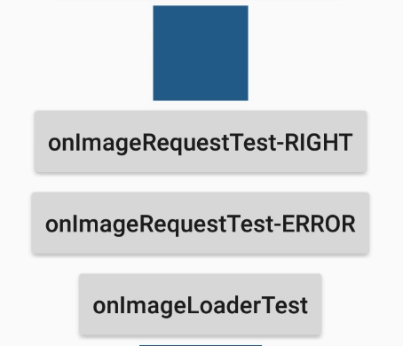

# 示例分析
Android 系统中主要提供了两种方式来进行 HTTP 通信，`HttpURLConnection`和 `HttpClient`，几乎在任何项目的代码中我们都能看到这两个类的身影，使用率非常高。

# 请求队列的单例实现
大致代码如下
```java
public class VolleySingleton {

    private static Context sContext;
    private static VolleySingleton sInstance;
    private RequestQueue mRequestQueue;
    private ImageLoader mImageLoader;

    private VolleySingleton(Context context) {
        sContext = context;
        mRequestQueue = getRequestQueue();
    }

    public static synchronized VolleySingleton getInstance(Context context) {
        if (sInstance == null) {
            sInstance = new VolleySingleton(context);
        }
        return sInstance;
    }

    private RequestQueue getRequestQueue() {
        if (mRequestQueue == null) {
            // getApplicationContext() is key, it keeps you from leaking the
            // Activity or BroadcastReceiver if someone passes one in.
            mRequestQueue = Volley.newRequestQueue(sContext);
        }
        return mRequestQueue;
    }

    public <T> void addToRequestQueue(Request<T> req) {
        getRequestQueue().add(req);
    }

    public ImageLoader getImageLoader() {
      if (mImageLoader == null) {
          mImageLoader = new ImageLoader(getRequestQueue(), new BitmapCache());
      }
      return mImageLoader;
    }
}
```

# StringRequest
构造并发送请求
```java
String url = "https://www.baidu.com";
Response.Listener<String> listener = new Response.Listener<String>() {
    @Override
    public void onResponse(String response) {
        Log.d(TAG, response);
    }
};
Response.ErrorListener errorListener = new Response.ErrorListener() {
    @Override
    public void onErrorResponse(VolleyError error) {
        Log.e(TAG, error.getMessage(), error);
    }
};
StringRequest req = new StringRequest(url, listener, errorListener);

VolleySingleton.getInstance(this).addToRequestQueue(req);
```
返回结果如下图所示


上述 `StringRequest` 的构造方法构造的其实是一个 `GET` 请求，使用另外一个构造方法可以构造 `POST` 或其它类型的请求，比如：
```java
StringRequest postRequest = new StringRequest(Request.Method.POST, url, listener, errorListener) {
    @Override
    protected Map<String, String> getParams() throws AuthFailureError {
        Map<String, String> params = new HashMap<>();
        params.put("param1", "value1");
        params.put("param2", "value2");
        params.put("param2", "value3");
        return params
    }
};
```

# JsonRequest
JsonRequest 是是一个抽象类，无法直接创建它的示例。但可以从它的两个直接子类 `JsonObjectRequest` 和 `JsonArrayRequest` 入手，用法都和 `StringRequest` 类似。

在编写测试代码前，写介绍个工具：[MockApi](http://wanandroid.com/tools/mockapi)  
功能如网页所述：支持生成一个访问链接，返回任何文本数据：JSON，XML等...

## JsonObjectRequest
现在我们在 MockApi 上生成一个访问链接  [http://wanandroid.com/tools/mockapi/1921/zhuanghongjiJsonObjectRequest](http://wanandroid.com/tools/mockapi/1921/zhuanghongjiJsonObjectRequest)  
>如果现在该链接失效的话，你可以自己使用该工具返回的你指定的数据。

链接返回内容为：
```JSON
{
  "students" : [
    {
      "id" : "3",
      "name" : "张三",
      "scope" : "93"
    },
    {
      "id" : "4",
      "name" : "李四",
      "scope" : "94"
    },
    {
      "id" : "5",
      "name" : "王五",
      "scope" : "95"
    },
    {
      "id" : "6",
      "name" : "赵六",
      "scope" : "96"
    },
    {
    "id" : "7",
    "name" : "孙七",
    "scope" : "97"
    }
  ]
}
```

示例代码和请求响应打印的日志如下：
```java
String url = "http://wanandroid.com/tools/mockapi/1921/zhuanghongjiJsonObjectRequest";
JsonObjectRequest request = new JsonObjectRequest(url, null, new Response.Listener<JSONObject>() {
    @Override
    public void onResponse(JSONObject response) {
        Log.d(TAG, "response = " + response.toString());
        try {
            JSONArray array = (JSONArray) response.get("students");
            for (int i = 0, length = array.length(); i < length; i++) {
                JSONObject student = (JSONObject) array.get(i);
                Log.d(TAG, "student name = " + student.get("name"));
            }
        } catch (JSONException e) {
            e.printStackTrace();
        }
    }
}, new Response.ErrorListener() {
    @Override
    public void onErrorResponse(VolleyError error) {
        Log.e(TAG, error.getMessage(), error);
    }
});
VolleySingleton.getInstance(this).addToRequestQueue(request);
```
```
com.zhuanghongji.volley.sample D/MainActivity: response = {"students":[{"id":"3","name":"张三","scope":"93"},{"id":"4","name":"李四","scope":"94"},{"id":"5","name":"王五","scope":"95"},{"id":"6","name":"赵六","scope":"96"},{"id":"7","name":"孙七","scope":"97"}]}
com.zhuanghongji.volley.sample D/MainActivity: student name = 张三
com.zhuanghongji.volley.sample D/MainActivity: student name = 李四
com.zhuanghongji.volley.sample D/MainActivity: student name = 王五
com.zhuanghongji.volley.sample D/MainActivity: student name = 赵六
com.zhuanghongji.volley.sample D/MainActivity: student name = 孙七
```

## JsonArrayRequest
现在我们在 MockApi 上生成另一个访问链接  [http://wanandroid.com/tools/mockapi/1921/zhuanghongjiJsonArrayRequest](http://wanandroid.com/tools/mockapi/1921/zhuanghongjiJsonArrayRequest)  

链接返回内容为：
```JSON
[
  {
    "id": "3",
    "name": "张三",
    "scope": "93"
  },
  {
    "id": "4",
    "name": "李四",
    "scope": "94"
  },
  {
    "id": "5",
    "name": "王五",
    "scope": "95"
  },
  {
    "id": "6",
    "name": "赵六",
    "scope": "96"
  },
  {
    "id": "7",
    "name": "孙七",
    "scope": "97"
  }
]
```

示例代码和请求响应打印的日志如下：
```java
String url = "http://wanandroid.com/tools/mockapi/1921/zhuanghongjiJsonArrayRequest";
JsonArrayRequest request = new JsonArrayRequest(url, new Response.Listener<JSONArray>() {
    @Override
    public void onResponse(JSONArray response) {
        Log.d(TAG, "response = " + response.toString());
        try {
            for (int i = 0, length = response.length(); i < length; i++) {
                JSONObject student = (JSONObject) response.get(i);
                Log.d(TAG, "student scope = " + student.get("scope"));
            }
        } catch (JSONException e) {
            e.printStackTrace();
        }

    }
}, new Response.ErrorListener() {
    @Override
    public void onErrorResponse(VolleyError error) {
        Log.e(TAG, error.getMessage(), error);
    }
});
VolleySingleton.getInstance(this).addToRequestQueue(request);
```
```
com.zhuanghongji.volley.sample D/MainActivity: response = [{"id":"3","name":"张三","scope":"93"},{"id":"4","name":"李四","scope":"94"},{"id":"5","name":"王五","scope":"95"},{"id":"6","name":"赵六","scope":"96"},{"id":"7","name":"孙七","scope":"97"}]
com.zhuanghongji.volley.sample D/MainActivity: student scope = 93
com.zhuanghongji.volley.sample D/MainActivity: student scope = 94
com.zhuanghongji.volley.sample D/MainActivity: student scope = 95
com.zhuanghongji.volley.sample D/MainActivity: student scope = 96
com.zhuanghongji.volley.sample D/MainActivity: student scope = 97
```

## 两个子类的不同点
`JsonObjectRequest` 与 `JsonArrayRequest` 的不同点在于，前者需要返回结果是 ”数组结构的Json数据“，而后者 “单个结构的Json数据”。

现在我们将上面两个示例的 url 调换一下进行测试。

### 若用 `JsonObjectRequest` 去请求 ”数组结构的Json数据“
Volley 会出现解析异常，回调 `onErrorResponse()` 方法，打印日志如下:
```
com.zhuanghongji.volley.sample E/MainActivity: org.json.JSONException: Value [{"id":"3","name":"张三","scope":"93"},{"id":"4","name":"李四","scope":"94"},{"id":"5","name":"王五","scope":"95"},{"id":"6","name":"赵六","scope":"96"},{"id":"7","name":"孙七","scope":"97"}] of type org.json.JSONArray cannot be converted to JSONObject
                                               com.android.volley.ParseError: org.json.JSONException: Value [{"id":"3","name":"张三","scope":"93"},{"id":"4","name":"李四","scope":"94"},{"id":"5","name":"王五","scope":"95"},{"id":"6","name":"赵六","scope":"96"},{"id":"7","name":"孙七","scope":"97"}] of type org.json.JSONArray cannot be converted to JSONObject
                                                   at com.android.volley.toolbox.JsonObjectRequest.parseNetworkResponse(JsonObjectRequest.java:73)
                                                   at com.android.volley.NetworkDispatcher.processRequest(NetworkDispatcher.java:132)
                                                   at com.android.volley.NetworkDispatcher.run(NetworkDispatcher.java:87)
                                                Caused by: org.json.JSONException: Value [{"id":"3","name":"张三","scope":"93"},{"id":"4","name":"李四","scope":"94"},{"id":"5","name":"王五","scope":"95"},{"id":"6","name":"赵六","scope":"96"},{"id":"7","name":"孙七","scope":"97"}] of type org.json.JSONArray cannot be converted to JSONObject
                                                   at org.json.JSON.typeMismatch(JSON.java:111)
                                                   at org.json.JSONObject.<init>(JSONObject.java:163)
                                                   at org.json.JSONObject.<init>(JSONObject.java:176)
                                                   at com.android.volley.toolbox.JsonObjectRequest.parseNetworkResponse(JsonObjectRequest.java:68)
                                                   at com.android.volley.NetworkDispatcher.processRequest(NetworkDispatcher.java:132) 
                                                   at com.android.volley.NetworkDispatcher.run(NetworkDispatcher.java:87) Â
```

### 若用 `JsonArrayRequest` 去请求 ”单一结构的Json数据“
Volley 也同样会出现解析异常，回调 `onErrorResponse()` 方法，打印日志如下：
```
com.zhuanghongji.volley.sample E/MainActivity: org.json.JSONException: Value {"students":[{"id":"3","name":"张三","scope":"93"},{"id":"4","name":"李四","scope":"94"},{"id":"5","name":"王五","scope":"95"},{"id":"6","name":"赵六","scope":"96"},{"id":"7","name":"孙七","scope":"97"}]} of type org.json.JSONObject cannot be converted to JSONArray
                                               com.android.volley.ParseError: org.json.JSONException: Value {"students":[{"id":"3","name":"张三","scope":"93"},{"id":"4","name":"李四","scope":"94"},{"id":"5","name":"王五","scope":"95"},{"id":"6","name":"赵六","scope":"96"},{"id":"7","name":"孙七","scope":"97"}]} of type org.json.JSONObject cannot be converted to JSONArray
                                                   at com.android.volley.toolbox.JsonArrayRequest.parseNetworkResponse(JsonArrayRequest.java:70)
                                                   at com.android.volley.NetworkDispatcher.processRequest(NetworkDispatcher.java:132)
                                                   at com.android.volley.NetworkDispatcher.run(NetworkDispatcher.java:87)
                                                Caused by: org.json.JSONException: Value {"students":[{"id":"3","name":"张三","scope":"93"},{"id":"4","name":"李四","scope":"94"},{"id":"5","name":"王五","scope":"95"},{"id":"6","name":"赵六","scope":"96"},{"id":"7","name":"孙七","scope":"97"}]} of type org.json.JSONObject cannot be converted to JSONArray
                                                   at org.json.JSON.typeMismatch(JSON.java:111)
                                                   at org.json.JSONArray.<init>(JSONArray.java:96)
                                                   at org.json.JSONArray.<init>(JSONArray.java:108)
                                                   at com.android.volley.toolbox.JsonArrayRequest.parseNetworkResponse(JsonArrayRequest.java:65)
                                                   at com.android.volley.NetworkDispatcher.processRequest(NetworkDispatcher.java:132) 
                                                   at com.android.volley.NetworkDispatcher.run(NetworkDispatcher.java:87) 
```

# ImageRequest
我们在页面上写了一个 `ImageView` 控件用于显示加载的图片，两个 `Button` 控件分别加载正确地址图片和错误地址图片（正确图片地址时加载的是 [wanandroid.com](http://www.wanandroid.com) 首页的 Logo，否则加载一个红色的 `drawable`）。

示例代码和效果演示
```java
String tag = view.getTag().toString();
String url = "RIGHT".equals(tag) ?
        "http://www.wanandroid.com/resources/image/pc/logo.png" : "http://ERROR.png";
final ImageView imageView = findViewById(R.id.imageView);
ImageRequest request = new ImageRequest(url, new Response.Listener<Bitmap>() {
    @Override
    public void onResponse(Bitmap response) {
        imageView.setImageBitmap(response);
    }
}, 0, 0, Bitmap.Config.RGB_565, new Response.ErrorListener() {
    @Override
    public void onErrorResponse(VolleyError error) {
        imageView.setImageResource(R.drawable.red);
    }
});

VolleySingleton.getInstance(this).addToRequestQueue(request);
```


`ImageRequest` 构造函数的参数
* 第三第四个参数分别用于指定允许图片最大的宽度和高度  
 * 如果网络图片实际宽度或高度大于这里的最大值，则会对图片进行压缩
 * 如果指定为0则表示不管图片有多大，都不会进行压缩

* 第五个参数用于指定图片的颜色属性，`Bitmap.Config` 的几个枚举值都可以使用
 * 其中 `ARGB_8888` 可展示最好的颜色属性，每个像素占据4个字节的大小
 * 而 `RGB_565` 则表示每个图片像素占据2个字节的大小

# ImageLoder
尽管 `ImageRequest` 已经很好用，但实际上 `ImageLoader` 更加高效，因为它不仅可以帮我们对图片进行缓存，还可以过滤掉重复的链接，避免重复发送请求。  

`ImageLoader` 的内部是通过 `ImageRequest` 实现的，并不是继承自 `Request` 的，所以用法跟其它请求有所不同，总结起来大致分为以下几个步骤：
1. 创建一个 `RequestQueue` 对象
2. 创建一个 `ImageLoader` 对象
3. 创建一个 `ImageListener` 对象
4. 调用 `ImageLoader` 的 `get()` 方法加载网络图片

在前面的 **请求队列的单例实现** 中我们已经写好了创建 `RequestQueue` 和 `ImageLoader` 的代码，下面贴个 `BitmapCache` 的实现代码
```java
// 作为创建 ImageLoader 的入参，用于缓存图片
public class BitmapCache implements ImageCache {

    private LruCache<String, Bitmap> mCache;

    public BitmapCache() {
        int maxSize = 10 * 1024 * 1024; // 缓存图片的大小设置为10M
        mCache = new LruCache<String, Bitmap>(maxSize) {
            @Override
            protected int sizeOf(String key, Bitmap value) {
                return value.getRowBytes() * value.getHeight();
            }
        };
    }

    @Override
    public Bitmap getBitmap(String url) {
        return mCache.get(url);
    }

    @Override
    public void putBitmap(String url, Bitmap bitmap) {
        mCache.put(url, bitmap);
    }
}
```

其余示例代码和效果演示如下：
```java
final ImageView imageView = findViewById(R.id.imageView);
String url = "http://www.wanandroid.com/resources/image/pc/logo.png";
ImageLoader.ImageListener listener = ImageLoader.getImageListener(
        imageView, R.drawable.green, R.drawable.red);
VolleySingleton.getInstance(this).getImageLoader().get(
        url, listener);
```


`ImageLoader.getImageListener()` 的参数：
* 第一个参数：imageView，用于指定显示图片的 `ImageView` 控件
* 第二个参数：defaultImageResId，开始加载网络图片和加载完成之前（即加载过程）显示的默认图片 id
* 第三个参数：errorImageResId，加载失败时显示的图片 id

从上面的动态图中可知：
* 第一次加载时会先显示默认图片，待加载完成后再显示指定的 logo
* 但当我们加载一张其它图片后，再去点击加载该 logo 时，并没有先加载默认图片，而是直接从缓存中加载了指定的 logo

调用 `ImagerLoader.get()` 方法来加载图片，如果想对图片的大小进行限制，可使用另外一个重载方法
```java
VolleySingleton.getInstance(this).getImageLoader().get(
        url, listener, 200, 200);
```
* 第三个参数用于指定最大宽度
* 第四个参数用于指定最大高度

# NetworkImageView
除了前面两种加载图片方式外，Volley 还提供了一个控件 `NetworkImageView`，它是继承自 `ImageView` 的，具备了 `ImageView` 的所有功能，并且在原生基础上加入了加载图片的功能。
使用方式的区别主要在于：
* 需在布局文件中添加 `NetworkImageView` 控件
* 在代码中获取该控件示例，然后设置要加载的图片地址

示例代码和效果演示如下：
```xml
<com.android.volley.toolbox.NetworkImageView
    android:id="@+id/networkImageView"
    android:layout_width="72dp"
    android:layout_height="36dp"
    android:background="#225b87" />
```
```java
String url = "https://www.baidu.com/img/bd_logo1.png"; // 百度首页 Logo
NetworkImageView networkImageView = findViewById(R.id.networkImageView);
networkImageView.setDefaultImageResId(R.drawable.green);
networkImageView.setErrorImageResId(R.drawable.red);

ImageLoader loader = VolleySingleton.getInstance(this).getImageLoader();
networkImageView.setImageUrl(url, loader);
```


# 自定义请求
当 Volley 提供的请求类型不满足我们的需求时，Volley 提供的扩展机制使得我们可以很轻松的定制任意类型的请求。

## 自定义 GsonRequest
先添加相关依赖
```gradle
implementation 'com.google.code.gson:gson:2.8.2'
```

实现代码
```Java
public class GsonRequest<T> extends Request<T> {

    private final Gson mGson = new Gson();

    private final Class<T> mClazz;

    @Nullable
    private final Map<String, String> mHeaders;

    private final Response.Listener<T> mListener;

    /**
     * Make a GET request and return a parsed object from JSON.
     *
     * @param url URL of the request to make
     * @param clazz Relevant class object, for Gson's reflection
     * @param headers Map of request headers
     */
    public GsonRequest(String url, Class<T> clazz, @Nullable Map<String, String> headers,
                       Response.Listener<T> listener, Response.ErrorListener errorListener) {
        super(Method.GET, url, errorListener);
        mClazz = clazz;
        mHeaders = headers;
        mListener = listener;
    }

    @Override
    public Map<String, String> getHeaders() throws AuthFailureError {
        return mHeaders != null ? mHeaders : super.getHeaders();
    }

    @Override
    protected Response<T> parseNetworkResponse(NetworkResponse response) {
        try {
            String json = new String(response.data,
                    HttpHeaderParser.parseCharset(response.headers));
            return Response.success(mGson.fromJson(json, mClazz),
                    HttpHeaderParser.parseCacheHeaders(response));
        } catch (UnsupportedEncodingException e) {
            return Response.error(new ParseError(e));
        }
    }

    @Override
    protected void deliverResponse(T response) {
        mListener.onResponse(response);
    }
}
```

我们先在 [MockApi](http://wanandroid.com/tools/mockapi) 生成一个返回链接 [http://wanandroid.com/tools/mockapi/1921/zhuanghongjiGsonRequest](http://wanandroid.com/tools/mockapi/1921/zhuanghongjiGsonRequest)，返回结果为：
```JSON
{
  "weatherInfo": {
    "city": "北京",
    "cityId": "101010100",
    "temp": "19",
    "wd": "南风",
    "ws": "2级",
    "sd": "43%",
    "wse": "2",
    "time": "19:45",
    "isRadar": "1",
    "radar": "JC_RADAR_AZ9010_JB"
  }
}
```

示例代码和响应打印结果：
```Java
String url = "http://wanandroid.com/tools/mockapi/1921/zhuanghongjiGsonRequest";
GsonRequest<Weather> request = new GsonRequest<>(url, Weather.class, null,
        new Response.Listener<Weather>() {
            @Override
            public void onResponse(Weather weather) {
                Log.d(TAG, "response = " + weather.toString());

            }
        }, new Response.ErrorListener() {
            @Override
            public void onErrorResponse(VolleyError error) {
                Log.e(TAG, error.getMessage(), error);
            }
});

VolleySingleton.getInstance(this).addToRequestQueue(request);
```
```
com.zhuanghongji.volley.sample D/MainActivity: response = Weather{weatherInfo=WeatherInfo{city='北京', cityId='101010100', temp='19', wd='南风', ws='2级', sd='43%', wse='2', time='19:45', isRadar='1', radar='JC_RADAR_AZ9010_JB'}}
```

## 自定义 XmlRequest
实现代码
```Java
public class XmlRequest extends Request<XmlPullParser> {

    private final Response.Listener<XmlPullParser> mListener;

    public XmlRequest(String url, Response.Listener<XmlPullParser> listener,
                      Response.ErrorListener errorListener) {
        this(Method.GET, url, listener, errorListener);
    }

    public XmlRequest(int method, String url, Response.Listener<XmlPullParser> listener,
                      Response.ErrorListener errorListener) {
        super(method, url, errorListener);
        mListener = listener;
    }

    @Override
    protected Response<XmlPullParser> parseNetworkResponse(NetworkResponse response) {
        try {
            String xmlString = new String(response.data, HttpHeaderParser.parseCharset(response.headers));
            XmlPullParserFactory factory = XmlPullParserFactory.newInstance();
            XmlPullParser parser = factory.newPullParser();
            parser.setInput(new StringReader(xmlString));
            return Response.success(parser, HttpHeaderParser.parseCacheHeaders(response));
        } catch (UnsupportedEncodingException e) {
            return Response.error(new ParseError(e));
        } catch (XmlPullParserException e) {
            return Response.error(new ParseError(e));
        }
    }

    @Override
    protected void deliverResponse(XmlPullParser response) {
        mListener.onResponse(response);
    }
}
```

我们先在 [MockApi](http://wanandroid.com/tools/mockapi) 生成一个返回链接 [http://wanandroid.com/tools/mockapi/1921/zhuanghongjiXmlRequest](http://wanandroid.com/tools/mockapi/1921/zhuanghongjiXmlRequest)，返回结果为：
```xml
<china dn="day" slick-uniqueid="3">
    <city quName="黑龙江" pyName="heilongjiang" cityname="哈尔滨" state1="0" state2="0" stateDetailed="晴" tem1="18" tem2="6" windState="西北风3-4级转西风小于3级"/>
    <city quName="吉林" pyName="jilin" cityname="长春" state1="0" state2="0" stateDetailed="晴" tem1="19" tem2="6" windState="西北风3-4级转小于3级"/>
    <city quName="辽宁" pyName="liaoning" cityname="沈阳" state1="0" state2="0" stateDetailed="晴" tem1="21" tem2="7" windState="东北风3-4级"/>
    <city quName="海南" pyName="hainan" cityname="海口" state1="1" state2="1" stateDetailed="多云" tem1="30" tem2="24" windState="微风"/>
    <city quName="内蒙古" pyName="neimenggu" cityname="呼和浩特" state1="0" state2="0" stateDetailed="晴" tem1="19" tem2="5" windState="东风3-4级"/>
</china>
```

示例代码和响应打印结果：
```Java
String url = "http://wanandroid.com/tools/mockapi/1921/zhuanghongjiXmlRequest";
XmlRequest request = new XmlRequest(url, new Response.Listener<XmlPullParser>() {
    @Override
    public void onResponse(XmlPullParser response) {
        try {
            int eventType = response.getEventType();
            while (eventType != XmlPullParser.END_DOCUMENT) {
                switch (eventType) {
                    case XmlPullParser.START_TAG:
                        String nodeName = response.getName();
                        if ("city".equals(nodeName)) {
                            String quName = response.getAttributeValue(0);
                            Log.d(TAG, "quName is " + quName);
                        }
                        break;
                }
                eventType = response.next();
            }
        } catch (XmlPullParserException e) {
            e.printStackTrace();
        } catch (IOException e) {
            e.printStackTrace();
        }
    }
}, new Response.ErrorListener() {
    @Override
    public void onErrorResponse(VolleyError error) {
        Log.e("TAG", error.getMessage(), error);
    }
});

VolleySingleton.getInstance(this).addToRequestQueue(request);
```
```
com.zhuanghongji.volley.sample D/MainActivity: quName is 黑龙江
com.zhuanghongji.volley.sample D/MainActivity: quName is 吉林
com.zhuanghongji.volley.sample D/MainActivity: quName is 辽宁
com.zhuanghongji.volley.sample D/MainActivity: quName is 海南
com.zhuanghongji.volley.sample D/MainActivity: quName is 内蒙古
```
